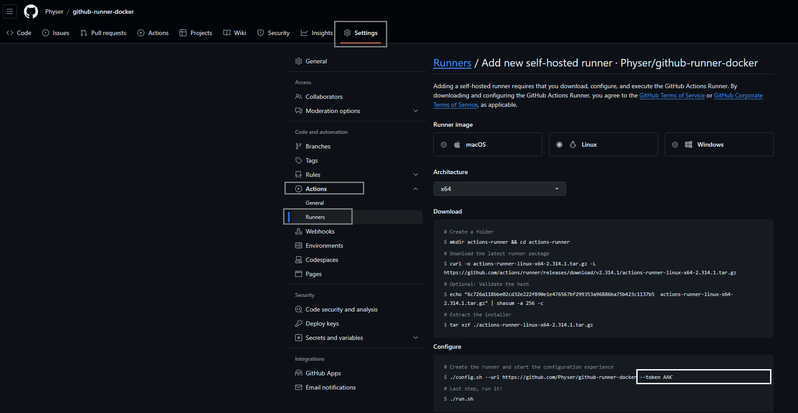

# A Github actions runner in Docker

## Introduction

This repository houses a Docker image for running Github Actions with a self-hosted runner.
The runner is a Docker container and can be run both locally and remotely.

The runner allows you to quickly spin up runners as needed for your public or private repositories on Github.

## How to register and run

In order to run this runner as a container, the following data is needed:

- A repository path (the part of the Github URL after `github.com`, e.g. `Physer/github-runner-docker`)
- An access token for your runner to connect to Github (more on this below)
- A name for your runner

### Getting an access token for your runner

In order to get an access token to connect the runner to your repository, follow these steps:

1. Go to your repository on Github
2. Navigate to the settings page
3. Under the `Code and automation` tab, expand the `Actions` item and select `Runners`
4. Select `New self-hosted runner` in the top right
5. Look at the `Configure` tab, your token will be avaiable



### Running the pre-built Docker image

You can find the Docker image on the [Docker Hub](https://hub.docker.com/r/physer/github-runner-docker).

#### Using the Docker CLI

Using the Docker CLI you can quickly run the Docker image as a container. Replace the environment variable values with your data and execute the following command:

`docker run --name github-runner-docker -d -e REPOSITORY_PATH=foo -e RUNNER_ACCESS_TOKEN=foo -e RUNNER_NAME=foo physer/github-runner-docker`

#### Using Docker Compose

You can also run the Docker container using Compose. Use the following service in your `compose.yaml` file:
```dockerfile
services:
  runner:
    image: physer/github-runner-docker
    container_name: github-runner-docker
    environment:
      - REPOSITORY_PATH=foo
      - RUNNER_ACCESS_TOKEN=foo
      - RUNNER_NAME=foo
```

### Building and running from source

If you wish to build and run the Docker container from the source of the repository, follow these steps:

1. Clone or download this repository
2. Copy the `.env.example` file and rename it to `.env`
3. Fill in the previously mentioned environment variables
4. Run `docker compose up -d`

## Additional software

Currently no additional software has been installed.

## References

- https://docs.github.com/en/actions/hosting-your-own-runners/managing-self-hosted-runners/about-self-hosted-runners
- https://github.com/actions/runner/blob/main/images/Dockerfile
